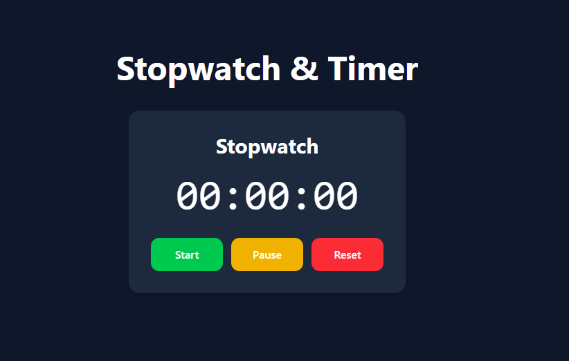

# ⏱️ Stopwatch & Timer App

A modern Stopwatch and Timer application built using React and Tailwind CSS.

## 🚀 Features

### Stopwatch
- Start functionality
- Pause functionality
- Reset functionality
- Live milliseconds tracking

### Timer
- Custom time input
- Countdown timer
- Start / Pause / Reset controls
- Auto stop at 0

## 🛠️ Tech Stack

- React
- Tailwind CSS
- JavaScript
- Vite

## 📸 Screenshots



## 📦 Installation

Clone the repository:

```bash
git clone <your-repo-link>
```

Navigate into project folder:

```bash
cd stopwatch-timer
```

Install dependencies:

```bash
npm install
```

Run the development server:

```bash
npm run dev
```

## 📚 Concepts Learned

- React Hooks
  - useState
  - useEffect
- State Management
- setInterval & cleanup
- Component-based architecture
- Event handling
- Time formatting
- Responsive UI design
- Tailwind CSS styling

## 🎯 Future Improvements

- Lap functionality
- Dark / Light mode
- Sound effects
- Progress animation
- Preset timers

## 👨‍💻 Author

Made with ❤️ by Rohan